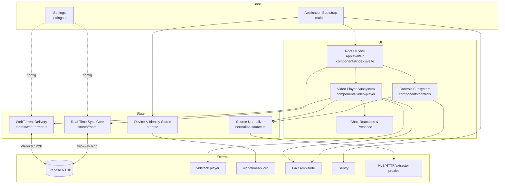
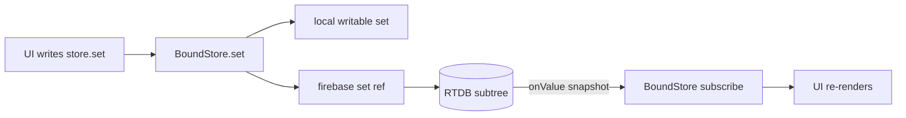
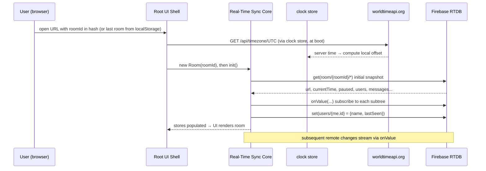
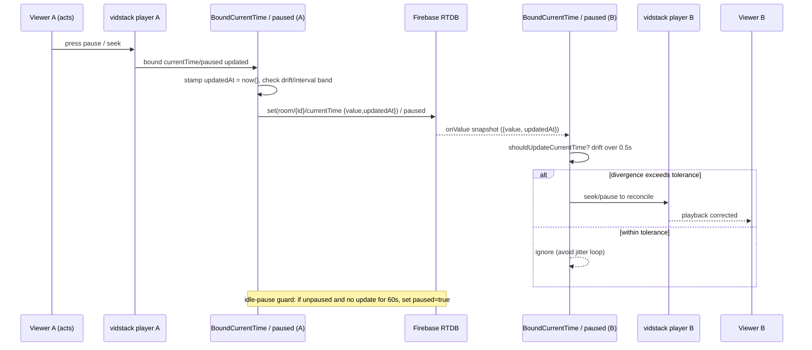
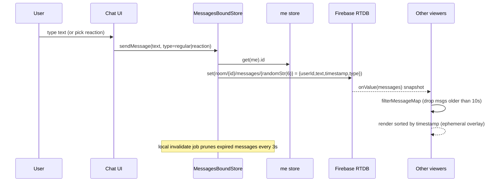
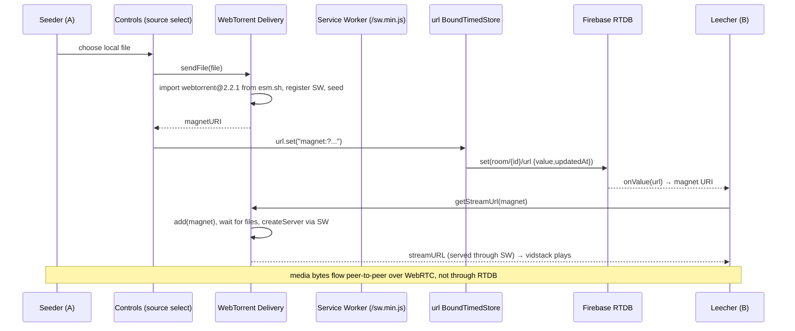

# Architecture

## System Overview

`watch-together` is a **client-only single-page application (SPA)** — a static
bundle served by nginx (or GitHub Pages) with **no first-party backend**. All
shared state lives in **Firebase Realtime Database (RTDB)**; the browser is the
only place application logic runs. "Watch together" is achieved by a
**timestamp-reconciled two-way binding layer** between Svelte stores and RTDB
subtrees, with an external clock (`worldtimeapi.org`) providing a common time
base so independently-clocked devices agree on playback position.

Video delivery is **pluggable**: a source string is classified (direct / HLS /
YouTube / Vimeo / magnet / blob) and routed either to the **vidstack** web
player or to a **WebTorrent** P2P pipeline that streams a peer's local file
through a Service Worker.

## Architectural Style

**Layered client SPA with an event-sourced-ish real-time sync core**, evidence:

- **No service/process boundaries** — single deployable static artifact
  (`vite build` → `dist/` served by nginx; see [dependencies.md](dependencies.md)
  build flow). Not microservices, not serverless.
- **Reactive state layer** — Svelte 5 runes in the UI; the sync layer implements
  the Svelte `Writable<T>` contract so UI binds to RTDB as if to local stores.
- **Backend-as-a-Service** — RTDB is the integration bus and system of record;
  cross-client coordination is by shared-state convergence, not RPC.
- **Ports/adapters at the edges** — external services (RTDB, WebTorrent, vidstack,
  analytics, Sentry, time API, proxies) are each isolated behind a store or a
  thin wrapper. Full contracts in [api-documentation.md](api-documentation.md).

**Trade-off**: choosing BaaS + shared-state convergence eliminates all server
code and ops (cheap, trivially scalable reads/writes, instant fan-out) at the
cost of **no server-side authority** — no auth, no validation, last-writer-wins
conflict semantics, and correctness that depends on client clock agreement.
This is a deliberate, reversible-at-cost decision recorded here and reflected in
the security debt in [code-quality-assessment.md](code-quality-assessment.md).

## Component Relationships

Components and their responsibilities are catalogued in
[component-inventory.md](component-inventory.md); this diagram shows how they
relate.

## Data Flow

The load-bearing concept is the **Bound Store family** in `stores/room/`. Each
store owns one RTDB subtree under `room/{roomId}` and implements `Writable<T>`,
so a UI write flows to RTDB and an RTDB change flows back to the UI:

Layering of the sync stores (evidence: `stores/room/index.ts`):

- `BoundStore<T>` — raw `Writable<T>` ↔ RTDB ref (`set` / `onValue` / `get`).
- `BoundTimedStore<T>` — wraps a `{ value, updatedAt }` envelope; accepts a
  remote value only if `updatedAt` is newer than local by more than a tolerance
  (last-writer-wins with a guard band). Used for `url`, `paused`.
- `BoundCurrentTime` — playback position with **drift correction**:
  `shouldUpdateCurrentTime` compares playback delta vs elapsed-time delta and
  only re-seeks when they diverge by `maximumDelta = 0.5s`; it throttles remote
  writes to a `syncInterval = 10s` band to avoid write storms.
- `UsersBoundStore` / `MessagesBoundStore` / `BoundMinutesWatched` — collection
  subtrees (presence, ephemeral chat, watch-time).

All timestamps come from `now()` in `stores/clock.ts`, which is offset by the
`worldtimeapi.org` reading so devices with skewed clocks still reconcile.

## Key Design Decisions (trade-offs)

| Decision | Rationale | Trade-off / consequence |
|---|---|---|
| BaaS (Firebase RTDB) as sole backend | Zero server code/ops; built-in real-time fan-out | No auth/validation; public rooms (security debt) |
| `Writable<T>` sync stores | UI treats remote state like local state; clean ports | Hides network/latency; conflict logic is subtle and untested |
| Timestamp + external clock reconciliation | Cross-device agreement without a server arbiter | Depends on `worldtimeapi.org` (single point of failure, unguarded) |
| Drift-tolerant seek (`maximumDelta`, tolerance bands) | Avoids feedback loops / jitter between players | Magic-number tuning, no tests to protect it |
| Pluggable source (`SourceBuilder` → vidstack \| WebTorrent) | One UI for links, YouTube/Vimeo, HLS, and local files | Two very different delivery paths to maintain |
| WebTorrent imported from `esm.sh` at runtime | Keeps heavy P2P lib out of the bundle/lockfile | Supply-chain + offline risk; untyped `any` (see debt) |
| Static deploy to GitHub Pages | Cheapest possible hosting, no infra | CD couples to branch `master` (org trunk is `main`) |

## Interaction Diagrams

### 1. User joins a room

### 2. Play / pause / seek sync

### 3. Send a chat message / reaction

### 4. Co-watch a local file (WebTorrent)

## Improvement Opportunities

These are architectural; itemized debt with locations lives in
[code-quality-assessment.md](code-quality-assessment.md).

- **Authority gap** — introduce auth/rules or a thin validation layer; today any
  client can overwrite any room subtree.
- **External-clock resilience** — the `worldtimeapi.org` dependency has no
  fallback/timeout; a local monotonic estimate or retry would remove a single
  point of failure for all timed sync.
- **Conflict-resolution safety net** — the drift/tolerance logic is the riskiest
  code and has no tests; it is the highest-value place to add coverage.
- **Delivery-path convergence** — the vidstack vs WebTorrent split doubles the
  player surface; an explicit adapter/port could reduce branchy coupling in the
  Video Player Subsystem.
