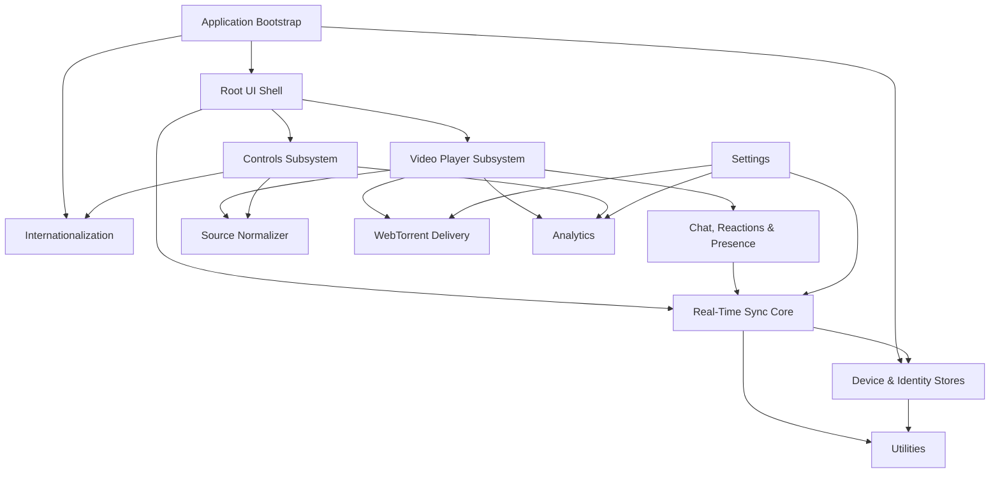

# Dependencies

Exact version pins live in [technology-stack.md](technology-stack.md); this file
records dependency **relationships** — what depends on what, at build vs runtime,
and the internal cross-module graph.

## External Dependencies by Consumption Mode

### Build-time (bundled by Vite)

All `package.json` entries are `devDependencies` and are bundled into the static
output; there is no runtime `dependencies` block shipped to the browser.

| Dependency | Consumed by (component) |
|---|---|
| `svelte`, `@sveltejs/vite-plugin-svelte`, `vite` | all UI + build |
| `vite-plugin-pwa` | Build & Deploy Tooling (service worker/manifest) |
| `vidstack` (+ plugin) | Video Player Subsystem |
| `firebase` | Real-Time Sync Core, Settings |
| `svelte-i18n` | Internationalization, Application Bootstrap |
| `uikit`, `sass` | UI styling |
| `@sentry/svelte` | Application Bootstrap |
| `@amplitude/analytics-browser` | Analytics |
| `prettier-bytes` | WebTorrent Delivery / stats display |
| `typescript`, `@tsconfig/svelte`, `svelte-check`, `tslib` | toolchain / `check` |

### Runtime (loaded in the browser, not bundled)

| Dependency | How loaded | Consumed by |
|---|---|---|
| `webtorrent@2.2.1` | dynamic ESM `import('https://esm.sh/...')` | WebTorrent Delivery |
| Firebase RTDB backend | network (config from `settings.ts`) | Real-Time Sync Core |
| `worldtimeapi.org` | `fetch` | Device & Identity Stores (clock) |
| Google Analytics + Amplitude | network sinks | Analytics |
| Sentry ingest | network | Application Bootstrap |
| HLS/HTTP/extractor proxies | network (optional, env-configured) | Video Player Subsystem |

### Node / ops-only

| Dependency | Consumed by |
|---|---|
| `firebase-admin` | Admin Scripts (`clean-db.js`, `stats.js`) |
| Docker, nginx, GitHub Actions/Pages | Build & Deploy Tooling |

## Referenced-but-Absent

Present in build/config references but not committed to the tree:

- `.env` — referenced by `buildargs.sh` / `Dockerfile`; supplies `VITE_*`.
- `.npmrc` — referenced by `Dockerfile`.
- `service-account-key.json` — required by Admin Scripts.
- `svelte-kit` — invoked by the `check` script (`svelte-kit sync`) but **not** a
  declared dependency; the project is a plain Vite + Svelte SPA, not SvelteKit
  (reconciled in [code-quality-assessment.md](code-quality-assessment.md)).

## Internal Cross-Module Dependency Graph

Component boundaries and files are in
[component-inventory.md](component-inventory.md); relationship diagram is in
[architecture.md](architecture.md). Key internal edges:

### Notable coupling observations

- **Settings is a fan-out hub** — many components read `settings.ts`; env-name
  drift there has wide blast radius.
- **Real-Time Sync Core is the fan-in hub** — Shell, Controls, Video Player, and
  Chat/Reactions all bind to it; it is the correctness centre of gravity.
- **`Destructable` (Utilities)** is a base class dependency for lifecycle-managed
  stores/components — low risk but broad reach.
- **No circular dependencies** were observed among the internal modules; delivery
  paths (vidstack vs WebTorrent) branch cleanly off the Source Normalizer.
