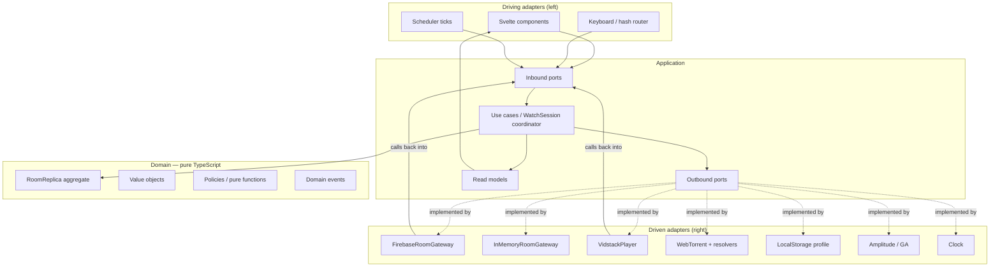
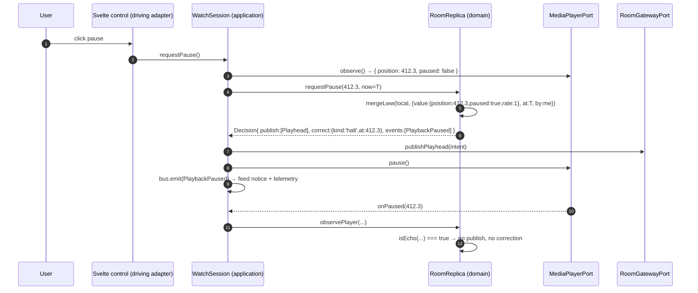
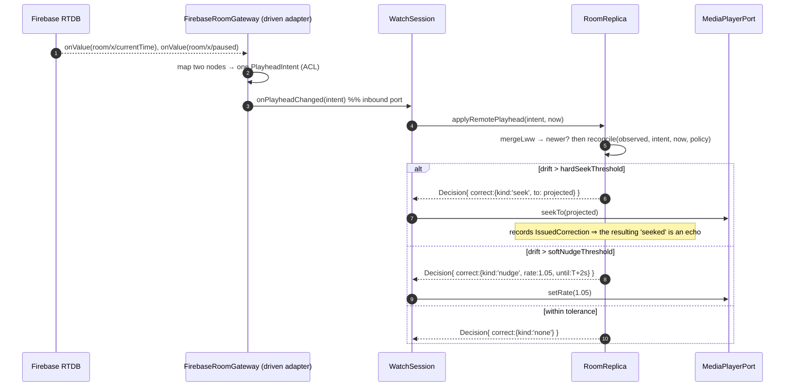
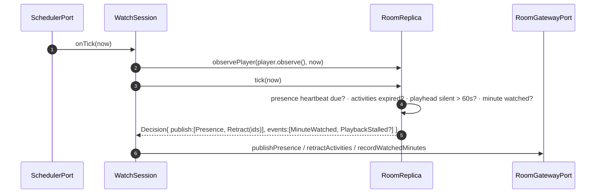

# Watch Together — DDD / Hexagonal Architecture Design

> **Status:** proposal (design only, nothing implemented yet)
> **Scope:** full rewrite of the internal structure of the SPA. No user-visible
> behaviour change, no backend introduction, no change to the Firebase schema in
> phase 1.
> **Baseline commit:** `6f71a2b`

---

## 1. Why

The application works, but its structure has one defining property: **there is no
place where "watching a video together" is described.** The rules that make the
product what it is are scattered across three layers that were never meant to
hold them.

### 1.1 Where the business logic actually lives today

| Rule | Where it lives now |
|---|---|
| "A remote position is only applied if it diverges from the expected one by >0.5s" | `src/stores/room/bound-current-time.ts:9` (`shouldUpdateCurrentTime`) |
| "A remote value wins if its timestamp is newer by more than the tolerance band" | `src/stores/room/bound-timed-store.ts:21` |
| "If playback is running but nothing was published for 60s, force pause" | `src/stores/room/index.ts:59` (inside `Room.init()`, in a `setInterval`) |
| "A participant is online if `lastSeen + 13s > now`" | `src/stores/room/bound-users.ts:35` — and, with a *different* constant (`10`), in `bound-users.ts:53` |
| "Chat messages live for 10 seconds" | `src/stores/room/bound-messages.ts:9` + `:41` |
| "Seeking/playing/pausing posts a system notice into the room feed" | `src/components/video-player/index.svelte:70,79,83` — **a UI component** |
| "Selecting a local file posts a notice into the room feed" | `src/components/room.svelte:26` — **a UI component** |
| "Watch time accrues one minute at a time while the position advances" | `src/stores/room/bound-minutes-watched.ts:26` |
| "Analytics events carry room context" | `src/analytics.svelte:43` — reads the transport stores directly |

Nothing above is unreasonable in isolation. Together they mean the answer to
"what are the synchronization rules?" is "read seven files, three of which are
`.svelte`".

### 1.2 Structural consequences, with evidence

These are not style complaints. Each is a defect that the current structure
*causes*, and that the proposed structure makes impossible.

**(a) Playback intent is split across two independent LWW registers.**
`paused` (`room/{id}/paused`) and `currentTime` (`room/{id}/currentTime`) are
separate Firebase refs with separate `updatedAt` stamps, written by separate
code paths (`bound-timed-store.ts` / `bound-current-time.ts`). Logically they
are *one* fact — "the playhead is at P, moving at rate R, as of time T". Because
they are two facts with two clocks, they can interleave: a peer can apply a new
`paused=true` against a stale `currentTime`, or a fresh `currentTime` against a
stale `paused`. The damping constants (`maximumDelta = 0.5`, `tolerance = 0.5`,
`syncInterval = 10`) exist largely to hide the resulting jitter.

**(b) `get(store)` re-attaches a Firebase listener.**
`BoundStore` registers `onValue` inside the `writable` start function
(`bound-store.ts:11`), so the subscription exists only while the store has
subscribers. Svelte's `get()` subscribes, reads, and immediately unsubscribes.
Therefore every `get(room.paused)` / `get(room.url)` / `get(room.users)` is a
full `onValue` attach + detach against the Realtime Database. `analytics.svelte`
does three of those **per tracked event** (`analytics.svelte:54,72,75`), and
`Room.init()`'s 60s guard does two more per tick. The domain does not own its own
state; it borrows it from the transport on demand.

**(c) The presence filter uses a frozen timestamp.**
`bound-users.ts:32` captures `const timeNow = now()` *outside* the subscription
callback, so the online cut-off is fixed at the moment of subscription and never
advances. A participant who disconnects can remain "online" indefinitely. The
sibling pruning job (`:55`) uses a hardcoded `10` where the filter uses
`onlineTimeout = 13`. Two copies of one rule, already out of sync.

**(d) Firebase is a compile-time dependency of the model.**
`stores/room/index.ts:15` creates the Firebase app at *module import time*, and
`Room`'s constructor takes `DatabaseReference`s. You cannot construct a `Room`
in a test, in Node, or against a different backend. There is no seam.

**(e) The player and the shared state are bidirectionally bound.**
`bind:paused={$paused}` / `bind:currentTime={$currentTime}`
(`video-player/index.svelte:100`) makes the `<media-player>` element and the
Firebase-backed store two masters of the same value. The feedback loop is
suppressed by ad-hoc flags in component scope (`saveCurrentTime`, `firstSeek`,
`currentVideoTime` — `video-player/index.svelte:64-66`). That is a distributed
state machine implemented in three booleans inside a view.

**(f) Writes are fire-and-forget.** `BoundStore.set` (`bound-store.ts:27`) calls
Firebase `set()` without awaiting or handling rejection. A failed write is
silent and the local store diverges permanently.

**(g) Zero tests.** Confirmed in the prior reverse-engineering pass
(`aidlc/spaces/default/codekb/watch-together/code-quality-assessment.md`). The
riskiest code in the repository — conflict resolution — is also the least
testable, because it can only run inside a browser holding a live Firebase
socket.

### 1.3 What we actually want out of this

Three concrete outcomes, in priority order:

1. **The synchronization rules become pure functions with tests.** Table-driven,
   millisecond-deterministic, no browser, no network.
2. **The shared-state backend becomes swappable.** `FirebaseRoomGateway`,
   `InMemoryRoomGateway` (tests + offline dev), and later
   `SupabaseRoomGateway` / `WebSocketRoomGateway` — all satisfying one port
   contract, verified by one shared contract-test suite.
3. **The video player becomes swappable and non-authoritative.** Vidstack today;
   the domain issues commands and consumes events, it does not two-way bind.

Everything else in this document is in service of those three.

---

## 2. Scope and non-goals

**In scope:** internal structure of `src/`, the port/adapter boundaries, the
domain model, the migration path, the test strategy.

**Non-goals (explicitly out):**

- No change to the Firebase RTDB schema in phase 1. The adapter maps the new
  domain types onto the existing paths so old and new clients interoperate.
- No authentication/authorization work. The public-rules problem
  (`OQ1` in the AI-DLC requirements baseline) is real but orthogonal.
- No new features. This is a structure change; the feature set is frozen for its
  duration.
- No framework change. Svelte 5 stays, and stays a *driving adapter*.
- No introduction of a backend service.

---

## 3. Strategic design

### 3.1 Subdomains

You suggested "probably just one domain". Almost — the *core* is one domain, but
two supporting subdomains are currently entangled with it and need to be pulled
out, because they change for entirely different reasons.

| Subdomain | Type | Why it is separate |
|---|---|---|
| **Co-Viewing Session** — rooms, participants, the shared playhead, presence, the ephemeral feed | **Core** | This is the product. It is where all the interesting invariants are. It changes when the *sync semantics* change. |
| **Media Delivery** — classifying a source string, resolving it through proxies/extractors, seeding & streaming via WebTorrent, delivery stats | **Supporting** | Changes when YouTube changes its URL format or a proxy dies. Has nothing to do with synchronization. Today it is spread over `normalize-source.ts`, `explore-url.ts`, `web-torrent.ts`. |
| **Viewer Identity** — the local participant's id, nickname, colour, persisted preferences | **Supporting** | Trivial, but currently executes side effects at module import (`stores/me.ts:20-24` writes `localStorage` and calls `setUserId` before anything asks it to). |
| Telemetry, i18n, error reporting, PWA shell | **Generic** | Buy/borrow. Pure adapters, never referenced from the core. |

### 3.2 Context map

```mermaid
graph LR
    subgraph core["Core: Co-Viewing Session"]
        RS[Room Replica aggregate<br/>+ sync policies]
    end
    subgraph md["Supporting: Media Delivery"]
        MR[Source classification<br/>resolution, P2P seeding]
    end
    subgraph vi["Supporting: Viewer Identity"]
        VI[Local participant<br/>+ preferences]
    end
    subgraph gen["Generic"]
        TL[Telemetry]
        I18[i18n]
        ER[Error reporting]
    end

    MR -->|Conformist:<br/>core owns MediaSourceRef VO| RS
    VI -->|Customer-Supplier:<br/>supplies ParticipantId, Nickname| RS
    RS -->|Published Language:<br/>domain events| TL
    RS -.->|never depends on.-> I18
    RS -.->|never depends on.-> ER
```

The important relationship is the first one. The core owns a small
`MediaSourceRef` value object (`{ kind, locator }`). Media Delivery is
*downstream*: it takes that VO and figures out how to actually get bytes. The
core never learns what an HLS proxy is. Today `normalize-source.ts` imports
`stores/video-example.ts`, which imports `settings.ts`, which reads
`import.meta.env` — environment configuration reaching into source
classification. That link gets cut.

### 3.3 Ubiquitous language

Names to use everywhere — code, tests, commits, this document. Where a term
replaces an existing one, the old name is shown.

| Term | Meaning | Replaces |
|---|---|---|
| **Room** | The shared, addressable co-viewing space. Identified by `RoomId`. | `Room` (kept) |
| **Room Replica** | The *local* copy of the room's shared state, with LWW merge rules. The aggregate root. | `Room` (class) |
| **Participant** | Someone in the room. `Local Participant` is the person at this browser. | `User` / `me` |
| **Playhead** | `{ position, paused, rate }` — the complete playback intent, as one atomic value. | `currentTime` + `paused`, separately |
| **Playhead Intent** | A `Stamped<Playhead>`: the playhead *as declared by someone at a point in time*. The shared source of truth. | — |
| **Projected Position** | `positionAt(intent, now)` — where the playhead *should* be right now, derived from the intent. | — (implicit in `shouldUpdateCurrentTime`) |
| **Observed Position** | Where the actual media element *is*. | `currentVideoTime` |
| **Drift** | `observed − projected`. | — |
| **Correction** | What the domain tells the player to do about drift: `none` / `nudge` / `seek` / `setPaused`. | implicit |
| **Echo** | A player event caused by a correction we ourselves just issued. Must never be re-published. | `saveCurrentTime`, `firstSeek` flags |
| **Presence** | `{ participantId, nickname, lastSeen }` published periodically. | `RawUser` |
| **Feed** | The ephemeral, TTL'd stream of chat messages, reactions and system notices. | `messages` |
| **Activity** | One item in the feed. Kinds: `chat`, `reaction`, `notice`. | `Message` + `MessageType` |
| **Media Source Ref** | `{ kind: direct\|hls\|youtube\|vimeo\|magnet\|local, locator }`. What the room agrees to watch. | `Source` |
| **Resolved Media** | A concrete, playable URL plus delivery metadata. The output of Media Delivery. | output of `exploreUrl` / `getStreamUrl` |
| **Sync Policy** | The named bundle of all timing constants. | scattered magic numbers |

---

## 4. Layering and the dependency rule



**The dependency rule, stated as three lines that CI will enforce:**

1. `src/domain/**` may import **only** from `src/domain/**`. No `svelte`, no
   `firebase`, no `vidstack`, no `import.meta.env`, no `Date`, no `Math.random`,
   no `setTimeout`, no `localStorage`, no `fetch`.
2. `src/application/**` may import from `src/domain/**` and
   `src/application/**`. It may **declare** ports; it may not import any adapter.
3. `src/adapters/**` may import from `src/application/ports/**` and
   `src/domain/**` (for the types it maps to/from), plus whatever third-party
   library it is adapting. Adapters **never** import each other.
4. Only `src/composition/**` may import everything. It is the composition root
   and the only place `new FirebaseRoomGateway(...)` appears.

Rule 1 has a sharp edge worth naming: **banning `Date.now()` in the domain is
the single most valuable constraint in this document.** Every timing bug in a
distributed system is a bug about *whose clock*. If the domain cannot read a
clock, every timestamp must be passed in, which means every test can control
time exactly, which means the drift logic becomes testable at all.

Enforcement: `dependency-cruiser` (or `eslint-plugin-boundaries`) with the four
rules above, wired into `npm run check` and the CI job. A violation fails the
build. Without mechanical enforcement, the boundaries erode in a month.

### 4.1 The one interface that bridges to Svelte for free

The domain and application layers must not import `svelte`. But the UI needs to
observe state. Define our own minimal contract:

```ts
// src/domain/shared/observable.ts
export type Unsubscribe = () => void;

export interface Observable<T> {
  /** Calls `run` synchronously with the current value, then on every change. */
  subscribe(run: (value: T) => void): Unsubscribe;
}
```

This is *structurally identical* to Svelte's store contract, so any object
implementing it works with the `$` prefix in a component with **zero**
dependency on Svelte in the application layer:

```svelte
<script lang="ts">
  const { view } = getContext<Session>('session');   // view.playback: Observable<PlaybackView>
</script>
<span>{ $playback.positionLabel }</span>
```

Same trick as today (`BoundStore implements Writable<T>`), but pointed the other
way: instead of the transport pretending to be a Svelte store, the application
publishes a framework-neutral contract that Svelte happens to understand. Svelte
5 runes can wrap it with `$state` + `$effect` if preferred; either works.

---

## 5. Domain model

All of `src/domain/**`. Pure TypeScript, no I/O, no framework, no globals.

### 5.1 Shared kernel

```ts
// domain/shared/time.ts
export type EpochMs     = number & { readonly __brand: 'EpochMs' };
export type Millis      = number & { readonly __brand: 'Millis' };
export type Seconds     = number & { readonly __brand: 'Seconds' };
```

Branded primitives. The compiler then refuses to let you pass a media position
(seconds) where a wall-clock timestamp (ms) is expected — a mistake the current
code is one typo away from at all times, since `clock.ts:9-17` works in *seconds*
while everything else in the browser is in *milliseconds*.

```ts
// domain/shared/stamped.ts
export interface Stamped<T> {
  readonly value: T;
  readonly at: EpochMs;          // synchronized clock, not Date.now()
  readonly by: ParticipantId;    // deterministic tie-break
}

/** LWW-Register merge: newest wins; ties broken deterministically by author. */
export const mergeLww = <T>(local: Stamped<T>, incoming: Stamped<T>): Stamped<T> => {
  if (incoming.at > local.at) return incoming;
  if (incoming.at < local.at) return local;
  return incoming.by > local.by ? incoming : local;
};
```

This is the textbook Last-Writer-Wins register: a total order over assignments
built from a timestamp, with a deterministic tie-break so that every replica
converges on the same value even when two writes share a timestamp. The current
`BoundTimedStore` implements roughly this but (a) has no tie-break, so two
simultaneous writes can leave replicas permanently disagreeing, and (b) folds a
*tolerance band* into the merge (`bound-timed-store.ts:21`), conflating
"which value won" with "is it worth reacting to". Those are two separate
decisions and the new model separates them: `mergeLww` decides the value,
`reconcile()` decides whether to act.

### 5.2 Value objects

```ts
// domain/room/ids.ts
export type RoomId        = string & { readonly __brand: 'RoomId' };
export type ParticipantId = string & { readonly __brand: 'ParticipantId' };
export type ActivityId    = string & { readonly __brand: 'ActivityId' };

export const roomId = (raw: string): RoomId => { /* validate: [a-z0-9_-]{3,64} */ };
```

```ts
// domain/room/media-source.ts
export type MediaSourceKind = 'direct' | 'hls' | 'youtube' | 'vimeo' | 'magnet' | 'localOnly';

export interface MediaSourceRef {
  readonly kind: MediaSourceKind;
  readonly locator: string;   // opaque to the core: a URL, a video id, a magnet URI
}
```

Note what is *not* here: no proxy URLs, no `esm.sh`, no `verifyUrl`, no
`Content-Type` sniffing. The core only needs to know that the room agreed on
*some* source, and enough about its kind to render the right affordances. All of
`explore-url.ts` and `web-torrent.ts` moves behind the `MediaResolverPort`.

```ts
// domain/room/playhead.ts
export interface Playhead {
  readonly position: Seconds;
  readonly paused: boolean;
  readonly rate: number;        // 1.0 today; the extension point for "watch at 1.5x together"
}

export type PlayheadIntent = Stamped<Playhead>;

/** Where the playhead should be at wall time `now`, given the declared intent. */
export const projectedPositionAt = (intent: PlayheadIntent, now: EpochMs): Seconds => {
  if (intent.value.paused) return intent.value.position;
  const elapsedSec = Math.max(0, (now - intent.at)) / 1000;
  return (intent.value.position + elapsedSec * intent.value.rate) as Seconds;
};
```

**This nine-line function is the centre of the whole design.** It replaces the
implicit model in `bound-current-time.ts` (where two deltas are subtracted from
each other and compared to an epsilon) with an explicit one: *shared playback
state is not a number, it is a linear function of time.* Once that is written
down, drift, reconciliation, the idle-pause guard, the "how often do we publish"
question, and the seek/pause ordering bug all become straightforward
consequences of it rather than independently-tuned heuristics.

```ts
// domain/room/participant.ts
export interface Presence {
  readonly participantId: ParticipantId;
  readonly nickname: Nickname;
  readonly lastSeen: EpochMs;
}

export interface Participant {
  readonly id: ParticipantId;
  readonly nickname: Nickname;
  readonly colour: HexColour;    // derived, deterministic from id (today: utils.stringToColor)
  readonly lastSeen: EpochMs;
}
```

```ts
// domain/room/activity.ts
export type ActivityBody =
  | { kind: 'chat';     text: string }
  | { kind: 'reaction'; emoji: string }
  | { kind: 'notice';   notice: Notice };

/** System notices are *domain events projected into the feed*, not chat text. */
export type Notice =
  | { type: 'seeked';  to: Seconds }
  | { type: 'played';  from: Seconds }
  | { type: 'paused';  at: Seconds }
  | { type: 'pickedLocalFile' }
  | { type: 'changedSource'; kind: MediaSourceKind };

export interface Activity {
  readonly id: ActivityId;
  readonly author: ParticipantId;
  readonly at: EpochMs;
  readonly body: ActivityBody;
}
```

Today these notices are produced by *view components* calling
`room.messages.sendMessage('', MessageType.seek)` and rendered by mapping
`MessageType` to an i18n key (`i18n/_.ts` → `player.chat.message.*`). In the new
model the domain emits a `PlaybackSeeked` event, an application policy decides
whether that event deserves a feed notice, and the i18n layer renders the
`Notice` VO. The view stops authoring domain facts.

### 5.3 The policy object — every magic number, in one place

```ts
// domain/room/sync-policy.ts
export interface SyncPolicy {
  /** Drift above this ⇒ hard seek. Today: 0.5 (bound-current-time.ts:6) */
  readonly hardSeekThreshold: Seconds;
  /** Drift above this ⇒ gentle playbackRate nudge instead of a seek. New. */
  readonly softNudgeThreshold: Seconds;
  readonly nudgeRateDelta: number;           // e.g. 0.05 ⇒ play at 0.95x / 1.05x
  readonly maxNudgeDuration: Millis;

  /** Republish an unchanged running playhead at most this often. Today: 10s */
  readonly playheadHeartbeat: Seconds;
  /** Running but nothing published for this long ⇒ force pause. Today: 60s */
  readonly stalePlaybackTimeout: Seconds;

  readonly presenceHeartbeat: Seconds;       // today: 5  (bound-users.ts:15)
  readonly presenceTimeout: Seconds;         // today: 13 (bound-users.ts:14) / 10 (:53) — pick one
  readonly activityTtl: Seconds;             // today: 10 (bound-messages.ts:9)
  readonly activitySweepInterval: Seconds;   // today: 3  (bound-messages.ts:10)

  /** How long after issuing a correction we treat player events as echoes. New. */
  readonly echoSuppressionWindow: Millis;
  /** Minimum clock confidence before we trust remote timestamps. New. */
  readonly requireClockSync: boolean;
}

export const DEFAULT_SYNC_POLICY: SyncPolicy = { /* the values above */ };
```

A single injected object. Tests construct degenerate policies (zero tolerance,
infinite tolerance) to pin down edge behaviour. Production can A/B a policy
without touching logic. And the `13` vs `10` presence discrepancy becomes
impossible to express.

### 5.4 Reconciliation — a pure function

```ts
// domain/room/reconcile.ts
export interface ObservedPlayback {
  readonly position: Seconds;
  readonly paused: boolean;
  readonly ready: boolean;       // media element has metadata and can seek
}

export type Correction =
  | { kind: 'none' }
  | { kind: 'seek';   to: Seconds }
  | { kind: 'nudge';  rate: number; until: EpochMs }
  | { kind: 'resume'; from: Seconds }
  | { kind: 'halt';   at: Seconds };

export const reconcile = (
  observed: ObservedPlayback,
  intent: PlayheadIntent,
  now: EpochMs,
  policy: SyncPolicy,
): Correction => {
  if (!observed.ready) return { kind: 'none' };

  const projected = projectedPositionAt(intent, now);

  if (intent.value.paused && !observed.paused) return { kind: 'halt',   at: projected };
  if (!intent.value.paused && observed.paused)  return { kind: 'resume', from: projected };
  if (intent.value.paused)                      
    return Math.abs(observed.position - projected) > policy.hardSeekThreshold
      ? { kind: 'seek', to: projected } : { kind: 'none' };

  const drift = observed.position - projected;
  if (Math.abs(drift) > policy.hardSeekThreshold) return { kind: 'seek', to: projected };
  if (Math.abs(drift) > policy.softNudgeThreshold)
    return { kind: 'nudge',
             rate: intent.value.rate + (drift < 0 ? policy.nudgeRateDelta : -policy.nudgeRateDelta),
             until: (now + policy.maxNudgeDuration) as EpochMs };
  return { kind: 'none' };
};
```

Two things this buys beyond testability:

- **Ordering is correct by construction.** `halt`/`resume` carry the projected
  position, so "pause" and "where we paused" can never arrive out of order —
  they are one value. The class of glitch described in §1.2(a) stops existing.
- **`nudge` is a genuinely better correction than a seek.** A 0.3s divergence
  today triggers nothing (below the 0.5s threshold) and then accumulates until
  it triggers a visible jump. Playing at 1.05x for two seconds absorbs 0.1s of
  drift imperceptibly. Every HTML media element supports `playbackRate`; the
  Vidstack adapter exposes it as `setRate`. This is optional for phase 1 — but
  the *shape* of the design should allow it, and `Correction` does.

### 5.5 Echo suppression — the state machine that is currently three booleans

The fundamental problem: `player.seekTo(x)` causes the player to emit `seeked`,
which looks exactly like a user seeking, which would be published to the room,
which comes back as a remote intent, which causes another correction. Today this
is damped by `saveCurrentTime` / `firstSeek` / `currentVideoTime` in
`video-player/index.svelte`, and by the 0.5s tolerance bands.

```ts
// domain/room/echo.ts
export interface IssuedCorrection {
  readonly correction: Correction;
  readonly issuedAt: EpochMs;
  readonly seq: number;
}

/**
 * A player event is an echo if we issued a matching correction inside the
 * suppression window and the event's state agrees with what we asked for.
 */
export const isEcho = (
  event: PlayerObservation,
  issued: IssuedCorrection | null,
  now: EpochMs,
  policy: SyncPolicy,
): boolean => {
  if (!issued) return false;
  if (now - issued.issuedAt > policy.echoSuppressionWindow) return false;
  switch (issued.correction.kind) {
    case 'seek':   return event.type === 'seeked' &&
                          Math.abs(event.position - issued.correction.to) < 0.75;
    case 'halt':   return event.type === 'paused';
    case 'resume': return event.type === 'played';
    default:       return false;
  }
};
```

Two candidate mechanisms were considered:

| Mechanism | Verdict |
|---|---|
| **Sequence tagging** — every command carries a seq; the adapter reports `onSettled(seq)`; events between issue and settle are echoes. | Correct in principle, but `HTMLMediaElement` gives no causal link between a `currentTime` assignment and the resulting `seeked` event. The adapter would have to fake the correlation, which is the heuristic below wearing a costume. |
| **Time window + value match** (above) | Chosen. Explicit, one pure function, exhaustively testable, and honest about being a heuristic. |

The key win is not that the heuristic is better than today's — it is that it is
**named, centralized, and covered by tests**, instead of implicit in a view
component's local variables.

### 5.6 The aggregate

```ts
// domain/room/room-replica.ts
export class RoomReplica {
  private constructor(
    private readonly roomId: RoomId,
    private readonly self: ParticipantId,
    private readonly policy: SyncPolicy,
    private state: RoomState,
  ) {}

  static create(roomId: RoomId, self: ParticipantId, policy: SyncPolicy, now: EpochMs): RoomReplica;

  // ---- local commands (from the UI, via use cases) -------------------------
  requestPlay(at: Seconds, now: EpochMs): Decision;
  requestPause(at: Seconds, now: EpochMs): Decision;
  requestSeek(to: Seconds, now: EpochMs): Decision;
  selectSource(ref: MediaSourceRef | null, now: EpochMs): Decision;
  postChat(id: ActivityId, text: string, now: EpochMs): Decision;
  throwReaction(id: ActivityId, emoji: string, now: EpochMs): Decision;
  rename(nickname: Nickname, now: EpochMs): Decision;

  // ---- remote updates (from the gateway, via the inbound listener) ---------
  applyRemotePlayhead(intent: PlayheadIntent, now: EpochMs): Decision;
  applyRemoteSource(src: Stamped<MediaSourceRef | null>, now: EpochMs): Decision;
  applyRemotePresence(all: readonly Presence[], now: EpochMs): Decision;
  applyRemoteActivity(all: readonly Activity[], now: EpochMs): Decision;

  // ---- time-driven (from the scheduler) ------------------------------------
  observePlayer(observed: ObservedPlayback, now: EpochMs): Decision;
  tick(now: EpochMs): Decision;     // heartbeats, TTL sweeps, stale-playback guard

  // ---- projections ---------------------------------------------------------
  snapshot(now: EpochMs): RoomSnapshot;
}

/** Everything the aggregate wants to happen, as data. The aggregate performs no I/O. */
export interface Decision {
  readonly events: readonly DomainEvent[];       // what happened (for telemetry, feed, UI)
  readonly publish: readonly PublishIntent[];    // what to write to the remote store
  readonly correct: Correction;                  // what to tell the player
}
```

The aggregate is a **pure state machine**: `(state, message, now) → (state', Decision)`.
It never awaits anything, never touches a port, never reads a clock. The
application layer executes the `Decision`. This is what makes the whole thing
testable — a test is a sequence of method calls with hand-written `now` values
and assertions on the returned `Decision`.

Invariants it enforces (none of which has a home today):

- **I1.** A published `PlayheadIntent` is always stamped with a synchronized
  clock reading, never a raw `Date.now()`.
- **I2.** `paused` and `position` are always published together, atomically.
- **I3.** A remote intent older than the local one is discarded (`mergeLww`),
  never applied "just because it arrived".
- **I4.** A correction is issued at most once per observation cycle, and a
  correction issued but not yet settled suppresses conflicting new ones.
- **I5.** An echo never produces a `PublishIntent`.
- **I6.** Presence is evaluated against the *current* `now`, always
  (kills bug §1.2(c)).
- **I7.** One TTL rule governs the feed; expiry is computed, never stored.
- **I8.** Watch-time accrues only while the projected playhead is actually
  advancing, not merely while the tab is open.
- **I9.** If clock confidence is `unsynced` and `policy.requireClockSync`, the
  replica refuses to publish and surfaces a degraded connection state rather
  than corrupting the room with skewed timestamps.

### 5.7 Domain events

```ts
// domain/room/events.ts
export type DomainEvent =
  | { type: 'RoomJoined';        roomId: RoomId }
  | { type: 'SourceChanged';     source: MediaSourceRef | null; by: ParticipantId; local: boolean }
  | { type: 'PlaybackStarted';   at: Seconds; by: ParticipantId; local: boolean }
  | { type: 'PlaybackPaused';    at: Seconds; by: ParticipantId; local: boolean }
  | { type: 'PlaybackSeeked';    to: Seconds; by: ParticipantId; local: boolean }
  | { type: 'DriftCorrected';    drift: Seconds; correction: Correction }
  | { type: 'PlaybackStalled';   silentFor: Seconds }
  | { type: 'ParticipantJoined'; participant: Participant }
  | { type: 'ParticipantLeft';   participantId: ParticipantId }
  | { type: 'ParticipantRenamed';participantId: ParticipantId; nickname: Nickname }
  | { type: 'ChatPosted';        activity: Activity }
  | { type: 'ReactionThrown';    activity: Activity }
  | { type: 'MinuteWatched';     total: number }
  | { type: 'ClockConfidenceChanged'; confidence: ClockConfidence };
```

This is the **published language** of the core. Three consumers subscribe to it
and nothing else:

- the **feed projection** (turns some events into `Notice` activities),
- the **telemetry projection** (replaces every `track(new XEvent(room))` call
  currently sprinkled through eight components — and, with it, the
  `get(room.*)`-per-event Firebase churn from §1.2(b)),
- the **read models** the UI renders.

---

## 6. Ports

Terminology follows Cockburn's original formulation: **primary / driving**
adapters invoke ports implemented *by* the application; on the **secondary /
driven** side the application invokes ports implemented *by* adapters. The
distinction is about who initiates the conversation, not about which way the
data flows — which matters here, because the Remote Store both receives our
writes (driven) and pushes us updates (which arrive through a driving port).

### 6.1 Driving ports — implemented by the application, called by adapters

#### 6.1.1 `WatchSessionCommands` — every control on the site

This is the port you described as "all the controls that exist on the site". One
interface, one implementation, injected into the Svelte tree via context.

```ts
// application/ports/inbound/watch-session-commands.ts
export interface WatchSessionCommands {
  // session lifecycle
  join(roomId: RoomId): Promise<void>;
  leave(): Promise<void>;

  // source selection  (controls/card-video-selector.svelte, video-selector-btn.svelte)
  setSourceFromUserInput(raw: string): Promise<SetSourceResult>;
  clearSource(): Promise<void>;
  shareLocalFile(file: File): Promise<void>;     // seed via P2P, publish magnet
  playLocalFilePrivately(file: File): Promise<void>;  // today's `blob` store
  pickExampleSource(): Promise<void>;

  // playback  (video-player/*)
  requestPlay(): void;
  requestPause(): void;
  requestSeek(to: Seconds): void;
  setMuted(muted: boolean): void;

  // social  (chat, reactions, card-users)
  postChatMessage(text: string): void;
  throwReaction(emoji: string): void;
  renameSelf(nickname: string): void;

  // navigation  (controls/index.svelte)
  generateNewRoom(): Promise<RoomId>;
  joinRoomByLinkOrId(input: string): Promise<RoomId>;
}
```

`SetSourceResult` is a discriminated union (`ok` / `unrecognized` / `resolving`)
so the input field can render the invalid state without the component knowing
what a YouTube regex is.

Note what is *absent*: no `Writable`, no `$url = value`. A control expresses an
*intention* with a name. The domain decides what happens. Today the video URL
input is `bind:value={$url}` — typing a character writes to Firebase on every
keystroke.

#### 6.1.2 `RemoteRoomListener` — inbound signals from the Remote Store

The port you described as "an inbound port to receive signals from the Remote
Storage". It is defined by the application and implemented by the application;
the gateway adapter *calls* it.

```ts
// application/ports/inbound/remote-room-listener.ts
export interface RemoteRoomListener {
  onSnapshot(snapshot: RemoteRoomSnapshot): void;          // initial full read
  onPlayheadChanged(intent: PlayheadIntent): void;
  onSourceChanged(source: Stamped<MediaSourceRef | null>): void;
  onPresenceChanged(all: readonly Presence[]): void;
  onActivityChanged(all: readonly Activity[]): void;
  onConnectionChanged(state: ConnectionState): void;       // online | offline | degraded | error
  onRemoteError(error: GatewayError): void;
}
```

Why a callback interface rather than returning `Observable<RemoteEvent>`: the
dependency arrow points the right way (adapter → application), it is explicit in
the type system which events an adapter must produce, and every adapter is held
to the same contract by the shared contract-test suite (§9.2). An
`Observable`-returning variant is ergonomically nicer in Svelte; if preferred,
provide a thin `listenerToObservable` bridge in the application layer — but keep
the port itself as the interface, because that is what contract tests target.

#### 6.1.3 `MediaPlayerListener` — inbound signals from the player

Symmetric. The Vidstack adapter is a *driven* adapter that also drives us.

```ts
// application/ports/inbound/media-player-listener.ts
export interface MediaPlayerListener {
  onReady(duration: Seconds): void;
  onPlayed(at: Seconds): void;
  onPaused(at: Seconds): void;
  onSeeked(to: Seconds): void;
  onProgress(position: Seconds): void;      // high-frequency; throttled by the adapter
  onStalled(): void;
  onEnded(): void;
  onError(error: PlayerError): void;
}
```

#### 6.1.4 `SessionTicks` — the scheduler as a driving adapter

```ts
export interface SessionTicks {
  onTick(now: EpochMs): void;   // drives heartbeats, TTL sweeps, the stale-playback guard
}
```

Today these are four independent `setInterval`s buried in four constructors
(`index.ts:60`, `bound-users.ts:67,71`, `bound-messages.ts:82`,
`bound-minutes-watched.ts:26`), each with its own period, each unstoppable
except through the `Destructable` chain. One tick, one policy, one place to fake
in tests.

### 6.2 Driven ports — implemented by adapters, called by the application

#### 6.2.1 `RoomGatewayPort` — the Remote Synchronized Store

The most important port in the system: the one you want a second implementation
of.

```ts
// application/ports/outbound/room-gateway.ts
export interface RoomGatewayPort {
  /** Opens the room, performs the initial read, and begins streaming updates. */
  open(roomId: RoomId, self: ParticipantId, listener: RemoteRoomListener): Promise<RoomSession>;
}

export interface RoomSession {
  publishPlayhead(intent: PlayheadIntent): Promise<void>;
  publishSource(source: Stamped<MediaSourceRef | null>): Promise<void>;
  publishPresence(presence: Presence): Promise<void>;
  appendActivity(activity: Activity): Promise<void>;
  retractActivities(ids: readonly ActivityId[]): Promise<void>;
  recordWatchedMinutes(delta: number): Promise<void>;
  /** Best-effort: register a "remove my presence" action for abrupt disconnects. */
  armDisconnectCleanup(): Promise<void>;
  close(): Promise<void>;
}
```

Design notes:

- **The port speaks domain types only.** No `DatabaseReference`, no snapshot, no
  path strings. An anti-corruption layer inside the adapter maps
  `PlayheadIntent` ⇄ the wire shape (`{ value, updatedAt }` at
  `room/{id}/currentTime` and `room/{id}/paused`, so the existing schema keeps
  working during migration — see §10).
- **Writes return `Promise<void>` and are awaited.** Fixes §1.2(f): a rejected
  write now surfaces as `onRemoteError` and a degraded connection state instead
  of silent divergence.
- **`armDisconnectCleanup()` exists specifically because Firebase can do this
  well and a generic port should not pretend otherwise.** The Firebase adapter
  implements it with `onDisconnect().remove()`; the documented presence recipe
  is to queue the disconnect operation *before* marking yourself online, to
  avoid the race where the connection drops between the two writes. Today there
  is no disconnect handling at all — presence relies purely on a 13s TTL, which
  is why "ghost" participants linger. An adapter that cannot do it implements a
  no-op, and the TTL still covers it.
- **`retractActivities` is explicit** rather than the current pattern of
  rewriting the whole message map (`bound-messages.ts:74`), which is a
  read-modify-write over a shared node — a lost-update race whenever two clients
  sweep at the same time.

#### 6.2.2 `MediaPlayerPort`

```ts
// application/ports/outbound/media-player.ts
export interface MediaPlayerPort {
  attach(listener: MediaPlayerListener): Unsubscribe;
  load(media: ResolvedMedia): Promise<void>;
  play(): Promise<void>;
  pause(): void;
  seekTo(position: Seconds): void;
  setRate(rate: number): void;
  setMuted(muted: boolean): void;
  observe(): ObservedPlayback;      // cheap synchronous read for reconcile()
}
```

Commands in, events out. **No `bind:`.** This is the change that kills §1.2(e).

#### 6.2.3 `MediaResolverPort` — the Media Delivery context's public face

```ts
// application/ports/outbound/media-resolver.ts
export interface MediaResolverPort {
  /** Classify raw user input. Pure; no network. (today: normalize-source.ts) */
  classify(raw: string): MediaSourceRef | null;
  /** Turn a ref into something playable. May hit proxies, extractors, P2P. */
  resolve(ref: MediaSourceRef, signal: AbortSignal): Promise<ResolvedMedia>;
  /** Seed a local file and return the ref to publish. (today: web-torrent.sendFile) */
  share(file: File): Promise<MediaSourceRef>;
  /** Live delivery telemetry for the UI. (today: web-torrent readable stores) */
  stats(): Observable<DeliveryStats>;
}

export interface ResolvedMedia {
  readonly ref: MediaSourceRef;
  readonly playbackUrl: string;
  readonly via: 'direct' | 'proxy' | 'extractor' | 'p2p' | 'blob';
}
```

Implemented by a `CompositeMediaResolver` delegating to `DirectResolver`,
`ProxyResolver`, `ExtractorResolver` (the WebSocket scraper in
`explore-url.ts:93`) and `WebTorrentResolver`. All the `esm.sh` runtime import,
the service-worker registration, the busy-wait polling loops and the module-level
`__client` / `__torrent` singletons stay inside that one adapter, where they
belong and where they can be replaced without touching anything else.

#### 6.2.4 `ClockPort` — the one that matters most

```ts
// application/ports/outbound/clock.ts
export type ClockConfidence = 'unsynced' | 'estimated' | 'synced';

export interface ClockPort {
  now(): EpochMs;
  readonly confidence: Observable<ClockConfidence>;
  sync(): Promise<void>;
}
```

Adapters:

| Adapter | Source | Notes |
|---|---|---|
| `FirebaseServerOffsetClock` | `.info/serverTimeOffset` | **Recommended.** Firebase exposes the offset (in ms) that a client should add to its local clock to estimate server time; it updates continuously over the same socket the data flows on, so timestamps live in the same causal domain as the values they stamp. No extra request, no extra failure mode. |
| `WorldTimeApiClock` | `worldtimeapi.org` | What exists today (`stores/clock.ts:5`). Keep as a fallback only. That service explicitly offers no SLA and is documented as going down for long periods, and there is no timeout, no retry and no rejection handling around the one `fetch` — a single point of failure for *all* timed sync. |
| `SystemClock` | `Date.now()` | Degraded mode; publishes `confidence: 'unsynced'`. |
| `FakeClock` | test-controlled | `advance(ms)`. The reason the domain is testable at all. |

`ClockConfidence` is part of the port because invariant **I9** needs it: a client
with an unsynchronized clock writing LWW timestamps can silently win every
conflict for the next hour, or lose every one. LWW is only as good as the clock
agreement underneath it; making confidence a first-class, observable value is
the honest way to handle that.

#### 6.2.5 The remaining driven ports

```ts
export interface SchedulerPort {
  every(period: Millis, fn: (now: EpochMs) => void): Unsubscribe;
  after(delay: Millis, fn: (now: EpochMs) => void): Unsubscribe;
}

export interface ProfileStorePort {                    // today: me.ts + local-store.ts
  load(): StoredProfile | null;                        // { participantId, nickname, lastRoomId, locale }
  save(profile: StoredProfile): void;
}

export interface IdGeneratorPort {                     // today: utils.randomStr(6) — collision-prone
  participantId(): ParticipantId;
  roomId(): RoomId;
  activityId(): ActivityId;
}

export interface TelemetryPort {                       // today: analytics.svelte
  record(event: DomainEvent, context: TelemetryContext): void;
  identify(participantId: ParticipantId): void;
}

export interface ErrorReporterPort {                   // today: Sentry in main.ts
  capture(error: unknown, context?: Record<string, unknown>): void;
}

export interface LocationPort {                        // today: document.location.hash in App.svelte
  currentRoomId(): RoomId | null;
  navigateToRoom(roomId: RoomId): void;
  onRoomChanged(fn: (roomId: RoomId) => void): Unsubscribe;
}
```

`IdGeneratorPort` is worth a sentence: `randomStr(6)` over a 36-char alphabet is
~31 bits. For room ids (user-visible, short) that is a deliberate trade-off. For
*activity ids* (`bound-messages.ts:90`) it is a birthday-collision waiting to
happen in a busy room, and a collision silently overwrites someone's message.
The adapter should use `crypto.randomUUID()` for activity ids and keep the short
alphabet only where a human has to type it.

---

## 7. Application layer

### 7.1 The coordinator

```ts
// application/watch-session.ts
export class WatchSession
  implements WatchSessionCommands, RemoteRoomListener, MediaPlayerListener, SessionTicks {

  constructor(
    private readonly gateway: RoomGatewayPort,
    private readonly player: MediaPlayerPort,
    private readonly resolver: MediaResolverPort,
    private readonly clock: ClockPort,
    private readonly scheduler: SchedulerPort,
    private readonly ids: IdGeneratorPort,
    private readonly telemetry: TelemetryPort,
    private readonly errors: ErrorReporterPort,
    private readonly policy: SyncPolicy,
  ) {}

  /** The single place where a Decision turns into I/O. */
  private async apply(decision: Decision): Promise<void> {
    for (const intent of decision.publish) await this.dispatchPublish(intent);
    this.dispatchCorrection(decision.correct);
    for (const event of decision.events) this.bus.emit(event);
  }
}
```

One class implements all four driving ports because they all mutate the same
aggregate and must be serialized against it. It is the *only* stateful,
*only* impure object in the application layer, and it contains no business rules
— it translates, sequences and executes.

Everything else is a thin function. Explicit "use case classes" for
`RequestPlayUseCase` would be pure ceremony at this scale; the methods on
`WatchSessionCommands` *are* the use cases. Where a use case genuinely
orchestrates several ports (`joinRoom`, `shareLocalFile`, `setSourceFromUserInput`)
it gets its own module and is called by the coordinator.

`joinRoom` is the one worth spelling out, because it is where the ordering rules
live:

```
joinRoom(roomId):
  1. profile      ← profileStore.load() ?? create with ids.participantId()
  2. await clock.sync()                       // I1, I9: never stamp before sync
  3. replica      ← RoomReplica.create(roomId, profile.id, policy, clock.now())
  4. session      ← gateway.open(roomId, profile.id, this)     // initial snapshot + streams
  5. await session.armDisconnectCleanup()     // BEFORE announcing presence — race safety
  6. apply(replica.applyRemoteSnapshot(snapshot, clock.now()))
  7. scheduler.every(tickPeriod, now => apply(replica.tick(now)))
  8. player.attach(this)
  9. emit RoomJoined
```

Step 5 before step 6 is the documented Firebase presence ordering: queue the
disconnect operation before marking yourself online, so a connection lost
between the two does not leave a permanent ghost.

### 7.2 Read models

The UI never reads the aggregate. It reads projections, recomputed from
`RoomSnapshot` + `now`:

```ts
// application/read-models/index.ts
export interface WatchSessionView {
  readonly connection:   Observable<ConnectionView>;   // online/offline/degraded + clock confidence
  readonly source:       Observable<SourceView>;       // raw input, kind, validity, resolution state
  readonly playback:     Observable<PlaybackView>;     // position, paused, buffering, drift (debug)
  readonly participants: Observable<ParticipantListView>;
  readonly feed:         Observable<FeedView>;         // chat + reactions + notices, already grouped
  readonly delivery:     Observable<DeliveryView>;     // peers, speed, progress, seeding
  readonly invite:       Observable<InviteView>;       // share URL, canShare
  readonly self:         Observable<SelfView>;         // nickname, colour, muted
}
```

Two rules that matter:

- **View models carry no domain types and no behaviour** — strings, numbers,
  booleans, arrays. A component cannot accidentally reach through them into the
  model (today: `room.messages.sendMessage(...)` from inside a chat component).
- **Position is *not* in a high-frequency view model.** Emitting the playhead at
  60fps through a store would re-render the component tree constantly. The
  player element renders its own position; the read model publishes position
  only at the granularity the UI actually displays it (~4Hz), and `drift` only
  in a debug overlay.

`feed` is where `groupConsecutiveElements` (`utils.ts:27`) and the sort/filter
logic from `bound-messages.ts:64` move — grouping is presentation, TTL is
domain, and today they are interleaved in one `subscribe`.

### 7.3 Projections driven by domain events

Three subscribers on the domain event bus, registered in the composition root:

| Projection | Replaces |
|---|---|
| `FeedNoticeProjection` — turns `PlaybackSeeked`/`Paused`/`Started`/`SourceChanged` into `Notice` activities and publishes them | `room.messages.sendMessage(..., MessageType.seek)` calls in `video-player/index.svelte` and `room.svelte` |
| `TelemetryProjection` — maps domain events to analytics events, assembling room context from the *local snapshot* | the entire `RoomEvent` base class in `analytics.svelte`, and its `get(room.*)` Firebase churn |
| `WatchTimeProjection` — accrues minutes from `MinuteWatched` and publishes to the gateway | `bound-minutes-watched.ts` |

After this, the string `track(` appears in exactly one file.

---

## 8. Adapters

| Port | Adapter | Wraps | Replaces |
|---|---|---|---|
| `RoomGatewayPort` | `FirebaseRoomGateway` | `firebase/database` | `stores/room/*` (all six files) |
| `RoomGatewayPort` | `InMemoryRoomGateway` | a `Map` + an event emitter | — (new: tests, offline dev, multi-tab demo) |
| `RoomGatewayPort` | `SupabaseRoomGateway` / `WsRoomGateway` | — | — (future; the point of the exercise) |
| `MediaPlayerPort` | `VidstackMediaPlayer` | `vidstack` custom element | `video-player-vidstack.svelte` bindings |
| `MediaPlayerPort` | `FakeMediaPlayer` | — | — (new: deterministic sync tests) |
| `MediaResolverPort` | `CompositeMediaResolver` | `normalize-source`, `explore-url`, `web-torrent` | those three files |
| `ClockPort` | `FirebaseServerOffsetClock` / `WorldTimeApiClock` / `SystemClock` / `FakeClock` | `.info/serverTimeOffset`, `fetch` | `stores/clock.ts` |
| `SchedulerPort` | `BrowserScheduler` / `FakeScheduler` | `setInterval` | 5 scattered `setInterval` call sites |
| `ProfileStorePort` | `LocalStorageProfileStore` | `localStorage` | `stores/me.ts`, `stores/local-store.ts` |
| `TelemetryPort` | `AmplitudeGaTelemetry` | Amplitude + gtag | `analytics.svelte` |
| `ErrorReporterPort` | `SentryErrorReporter` | `@sentry/svelte` | `main.ts` Sentry block |
| `LocationPort` | `HashLocation` | `document.location` | `App.svelte` hash logic |
| `IdGeneratorPort` | `CryptoIdGenerator` | `crypto` | `utils.randomStr` |
| driving | Svelte 5 components | — | `components/**` (kept, but made dumb) |

### 8.1 `FirebaseRoomGateway` — the anti-corruption layer in detail

This adapter is where the wire format lives, and it is the reason the migration
can be incremental. Phase 1 keeps the existing RTDB schema exactly:

| Domain concept | RTDB path | Wire shape |
|---|---|---|
| `Stamped<MediaSourceRef \| null>` | `room/{id}/url` | `{ value: string, updatedAt: number }` |
| `PlayheadIntent` | `room/{id}/currentTime` **+** `room/{id}/paused` | two `{ value, updatedAt }` nodes |
| `Presence` | `room/{id}/users/{participantId}` | `{ name, lastSeen }` |
| `Activity` | `room/{id}/messages/{id}` | `{ userId, text, type, timestamp }` |
| watched minutes | `room/{id}/minutesWatched/{participantId}` | `number` |
| — | `room/{id}/createdAt` | `number` (used by `clean-db.js`) |

The split of one `PlayheadIntent` across two nodes is the unavoidable ugliness of
keeping the old schema, and it is *contained in the mapper*: on write, the
adapter writes both nodes with the **same** `updatedAt`; on read, it joins them
and takes the newer stamp. Old clients keep working. The domain sees one atomic
value and never learns about the split.

Phase 2 (optional, later) adds `room/{id}/playhead` as a single node, with the
adapter dual-writing for one release before dropping the legacy paths.

Other adapter responsibilities:

- Firebase `set()` rejections → `listener.onRemoteError` + `ConnectionState`.
- `.info/connected` → `ConnectionState` (today: nothing; the app cannot tell it
  is offline, and `i18n` even has a `noInternet` string with no code behind it).
- `onDisconnect().remove()` on the presence node for `armDisconnectCleanup()`.
- `onValue` listeners attached **once** per room session and torn down in
  `close()` — not attached and detached per `get()` as they are today.

### 8.2 `VidstackMediaPlayer`

Owns everything `bind:` does today. Responsibilities:

- Translate `<media-player>` events into `MediaPlayerListener` calls.
- Throttle `time-update` to ~4Hz before calling `onProgress` (today every
  `timeupdate` runs component reactive statements).
- Implement `observe()` as a synchronous read of `currentTime` / `paused` /
  `readyState` — `reconcile()` needs a cheap snapshot, not a store subscription.
- Swallow nothing: echo detection is the *domain's* job, not the adapter's.

The Svelte component around it becomes: render `<media-player>`, hand the element
to the adapter on mount, hand it back on destroy. No `bind:paused`, no
`bind:currentTime`, no `saveCurrentTime`, no `firstSeek`.

---
## 9. Directory layout

Grouped by **bounded context first, layer second** — the normal DDD /
modular-monolith shape. Everything one context owns sits in one folder, a change
lands in one place, and a second context is a sibling rather than four edits
spread across four layer folders.

```
src/
├── domains/
│   └── watch-session/                    # the bounded context
│       ├── model/                        # THE DOMAIN LAYER — pure, imports nothing outward
│       │   ├── shared/
│       │   │   ├── brand.ts              # nominal typing helper
│       │   │   ├── time.ts               # EpochMs, Seconds, Millis (branded)
│       │   │   ├── observable.ts         # Observable<T>, Unsubscribe
│       │   │   ├── stamped.ts            # Stamped<T>, mergeLww
│       │   │   └── clock-confidence.ts
│       │   ├── ids.ts                    # RoomId, ParticipantId, ActivityId, Nickname
│       │   ├── media-source.ts           # MediaSourceRef, MediaSourceKind
│       │   ├── playhead.ts               # Playhead, PlayheadIntent, projectedPositionAt
│       │   ├── participant.ts            # Participant, Presence
│       │   ├── activity.ts               # Activity, Notice
│       │   ├── connection.ts             # ConnectionState
│       │   ├── sync-policy.ts            # SyncPolicy + DEFAULT / LEGACY
│       │   ├── reconcile.ts              # Correction, reconcile()
│       │   ├── echo.ts                   # isEcho()
│       │   ├── presence-policy.ts
│       │   ├── retention-policy.ts
│       │   ├── room-state.ts             # RoomState, RoomSnapshot
│       │   ├── decision.ts               # Decision, PublishIntent
│       │   ├── events.ts                 # DomainEvent union
│       │   └── room-replica.ts           # the aggregate root
│       │
│       ├── ports/
│       │   ├── index.ts                  # THE IMPLEMENTATION: WatchSession + deps + factory
│       │   ├── event-bus.ts              # internal synchronous fan-out
│       │   ├── inbound/                  # implemented BY the context, called BY adapters
│       │   │   ├── index.ts
│       │   │   ├── watch-session-commands.ts
│       │   │   ├── watch-session-view.ts
│       │   │   ├── views.ts
│       │   │   ├── remote-room-listener.ts
│       │   │   ├── media-player-listener.ts
│       │   │   └── session-ticks.ts
│       │   └── outbound/                 # implemented BY adapters, called BY the context
│       │       ├── index.ts
│       │       ├── room-gateway.ts
│       │       ├── media-player.ts
│       │       ├── media-resolver.ts
│       │       ├── clock.ts
│       │       ├── scheduler.ts
│       │       ├── profile-store.ts
│       │       ├── id-generator.ts
│       │       ├── telemetry.ts
│       │       ├── error-reporter.ts
│       │       └── location.ts
│       │
│       ├── use-cases/                    # only the multi-port flows
│       │   ├── join-room.ts
│       │   ├── set-source.ts
│       │   └── share-local-file.ts
│       └── projections/
│           ├── feed-notices.ts
│           ├── telemetry.ts
│           └── watch-time.ts
│
├── adapters/
│   ├── driving/
│   │   └── svelte/                       # the component tree, made dumb
│   └── driven/
│       ├── firebase/                     # gateway + mappers (ACL) + server-offset clock
│       ├── memory/                       # in-memory gateway
│       ├── vidstack/
│       ├── media/                        # classify, proxy, extractor, webtorrent
│       ├── browser/                      # scheduler, profile store, ids, location
│       ├── telemetry/
│       └── sentry/
│
├── composition/
│   ├── container.ts                      # the ONLY file that wires concrete classes
│   ├── config.ts                         # ex settings.ts — reads import.meta.env, nowhere else
│   └── bootstrap.ts                      # ex main.ts
│
├── i18n/
└── legacy/                               # frozen; deleted at migration step 6
```

**`model/` is separate from `ports/` for exactly one reason.** "Domain" names
two different things: `watch-session/` is the *bounded context* (the whole
module, ports included), `model/` is the *domain layer*. The domain layer must
not know that `RoomGatewayPort` or `ClockPort` exist. If they shared a folder,
nothing would stop `playhead.ts` from importing `ports/outbound/clock.ts`, and
the moment the model can read a clock, every synchronization rule stops being a
pure function of its arguments — which is the entire point of the refactor.

Where port *interfaces* live (domain layer vs application layer) is genuinely
contested in the literature; what is not contested is that the model must not
depend on infrastructure. Putting the ports in the context but outside the model
satisfies that without inventing an `application/` layer this codebase has no
other use for.

Test files sit next to their subject (`reconcile.spec.ts` beside
`reconcile.ts`), except the port contract suites, which live in
`ports/outbound/__contracts__/`.

Enforced by `npm run check:skeleton`: a `types: []` typecheck of
`src/domains/**` plus `scripts/check-boundaries.mjs`, which fails on a framework
import anywhere in the context, a `model/ -> ports/` import, or any use of
`Date.now`, `Math.random`, `setTimeout`, `setInterval`, `localStorage` or
`fetch` inside `model/`. `dependency-cruiser` replaces the grep at step 0.

## 10. Data flows

### 10.1 Local pause



The echo at the end is the case the current architecture handles with a boolean
in a view component. Here it is one call to a tested pure function.

### 10.2 Remote playhead arrives



### 10.3 Scheduler tick



One tick replaces five independent intervals. The stale-playback guard, presence
heartbeat, TTL sweep and watch-time accrual all become branches of one pure
`tick(now)` — and all four become testable by calling `tick` with hand-picked
timestamps instead of waiting 60 real seconds.

---

## 11. Where every current file goes

| Today | Tomorrow |
|---|---|
| `stores/room/index.ts` | `domain/room/room-replica.ts` + `application/watch-session.ts` + `adapters/driven/firebase/firebase-room-gateway.ts` |
| `stores/room/bound-store.ts` | deleted (absorbed into the gateway adapter) |
| `stores/room/bound-timed-store.ts` | `domain/shared/stamped.ts` (`mergeLww`) + adapter mapping |
| `stores/room/bound-current-time.ts` | `domain/room/playhead.ts` + `domain/room/reconcile.ts` |
| `stores/room/bound-users.ts` | `domain/room/presence-policy.ts` + gateway presence methods |
| `stores/room/bound-messages.ts` | `domain/room/activity.ts` + `retention-policy.ts` + gateway activity methods |
| `stores/room/bound-minutes-watched.ts` | `application/projections/watch-time.ts` |
| `stores/clock.ts` | `application/ports/outbound/clock.ts` + `adapters/driven/firebase/firebase-clock.ts` |
| `stores/me.ts`, `stores/local-store.ts` | `adapters/driven/browser/local-storage-profile-store.ts` |
| `stores/user.ts` | `domain/room/participant.ts` |
| `stores/blob.ts` | folded into `MediaSourceRef{kind:'localOnly'}` + resolver |
| `stores/web-torrent.ts` | `adapters/driven/media/webtorrent-resolver.ts` |
| `stores/video-example.ts` | `composition/config.ts` + a `pickExampleSource` use case |
| `stores/cursor.ts` | stays a UI concern → `adapters/driving/svelte/` |
| `normalize-source.ts` | `domain/room/media-source.ts` (the VO) + `adapters/driven/media/classify.ts` (the regexes) |
| `components/video-player/explore-url.ts` | `adapters/driven/media/proxy-resolver.ts` |
| `analytics.svelte` | `application/projections/telemetry.ts` + `adapters/driven/telemetry/` |
| `settings.ts` | `composition/config.ts` |
| `destructable.ts` | deleted — lifetimes become explicit `Unsubscribe` returns |
| `utils.ts` | split: `stringToColor`/`groupConsecutiveElements` → view helpers; `randomStr` → id adapter; `sleep` → deleted |
| `main.ts` | `composition/bootstrap.ts` |
| `App.svelte` hash logic | `adapters/driven/browser/hash-location.ts` |
| `components/**` | `adapters/driving/svelte/**`, with all `room.*` access replaced by `commands` + `view` |
| `i18n/**` | unchanged |
| `clean-db.js`, `stats.js` | unchanged (Node admin scripts, separate lifecycle) |

---

## 12. Testing strategy

Today: zero tests, and the riskiest code is untestable by construction. The
architecture exists mostly to change that sentence.

### 12.1 Domain tests — the bulk of the value

Pure, synchronous, sub-millisecond. `vitest`, no jsdom, no mocks — only
hand-built values.

```ts
describe('reconcile', () => {
  const T = 1_000_000 as EpochMs;
  const intent = stamped({ position: 100, paused: false, rate: 1 }, T, alice);

  it('does nothing while the player tracks the projected position', () => {
    expect(reconcile({ position: 105, paused: false, ready: true },
                     intent, (T + 5_000) as EpochMs, POLICY))
      .toEqual({ kind: 'none' });
  });

  it('hard-seeks when the player lags beyond the threshold', () => {
    expect(reconcile({ position: 101, paused: false, ready: true },
                     intent, (T + 5_000) as EpochMs, POLICY))
      .toEqual({ kind: 'seek', to: 105 });
  });

  it('nudges the rate for sub-threshold drift instead of jumping', () => { /* ... */ });
  it('never corrects before the media element is ready', () => { /* ... */ });
  it('halts at the projected position, not the stale one', () => { /* ... */ });
});
```

Target coverage on `src/domain/**`: 100% branch. It is ~600 lines of pure
functions; anything less is laziness.

Property-based tests (`fast-check`) are worth it for exactly two things:

- **LWW convergence:** for any interleaving of N writes delivered in any order to
  M replicas, all replicas end on the same `Stamped<T>`. This catches the missing
  tie-break bug (§5.1) and any future merge change.
- **No oscillation:** feeding `reconcile`'s own output back as the next observed
  state must reach a fixed point within K iterations for any starting drift.
  That is the formal statement of "the sync must not fight itself" — precisely
  the failure mode the current magic constants are tuned to avoid empirically.

### 12.2 Port contract tests

One suite per port, run against *every* adapter. This is what makes "swap the
backend" a real claim rather than a hopeful one.

```ts
// application/ports/outbound/__contracts__/room-gateway.contract.ts
export const roomGatewayContract = (name: string, make: () => RoomGatewayPort) =>
  describe(`RoomGatewayPort contract: ${name}`, () => {
    it('delivers an initial snapshot before any incremental update');
    it('echoes a published playhead back to a second session in the same room');
    it('does not deliver updates from a different room');
    it('reports onRemoteError on a rejected write');
    it('stops delivering after close()');
    it('removes presence after armDisconnectCleanup + disconnect');
    it('preserves the stamp (at, by) through a publish/receive round trip');
  });

roomGatewayContract('in-memory', () => new InMemoryRoomGateway());
roomGatewayContract('firebase-emulator', () => new FirebaseRoomGateway(emulatorConfig));
```

The Firebase run is opt-in (`vitest --project=integration`) against the
Firebase Local Emulator Suite, so the default `npm test` needs no network.

### 12.3 Scenario tests — two clients, one clock, no browser

The tests that would have caught every sync bug in the repo's history:

```ts
it('a pause by Alice pauses Bob at the same position', async () => {
  const world = new TestWorld();                   // FakeClock + FakeScheduler + InMemoryGateway
  const alice = await world.join('room-1', 'alice');
  const bob   = await world.join('room-1', 'bob');

  await alice.setSource('https://example.com/v.mp4');
  await alice.requestPlay();
  world.advance(30_000);                            // 30 virtual seconds

  await alice.requestPause();
  world.flush();

  expect(bob.player.observe()).toEqual({ position: 30, paused: true, ready: true });
});

it('a client with a 5s clock skew does not hijack the room', async () => { /* ... */ });
it('a message expires exactly at the TTL boundary, on both clients', async () => { /* ... */ });
it('a participant that stops heartbeating disappears from presence', async () => { /* ... */ });
```

Whole distributed scenarios, deterministic, in milliseconds, with no browser and
no Firebase. This is the single biggest practical payoff of the refactor.

### 12.4 What stays untested

Adapters that are pure translation (Sentry, telemetry) get no unit tests — the
contract tests cover the ones that matter. Svelte components get no unit tests;
once they hold no logic there is nothing to assert. A handful of Playwright
smoke tests (join a room in two browser contexts, verify sync) covers the wiring
end-to-end. That is the whole pyramid: wide pure base, narrow contract middle,
three or four e2e at the top.

---

## 13. Enforcing the architecture

Structure that is not mechanically enforced decays. Three gates, all in CI:

1. **`dependency-cruiser`** with the four rules from §4, as a `forbidden`
   ruleset. Example rule:
   ```js
   { name: 'domain-is-pure',
     severity: 'error',
     from: { path: '^src/domain' },
     to:   { pathNot: '^src/domain', couldNotResolve: false } }
   ```
   plus a rule banning `firebase|svelte|vidstack|webtorrent` from
   `^src/(domain|application)`.
2. **A lint rule banning ambient nondeterminism in the domain**:
   `no-restricted-globals` / `no-restricted-properties` for `Date`,
   `Math.random`, `setTimeout`, `setInterval`, `fetch`, `localStorage`,
   `crypto`, `window`, `import.meta` under `src/domain/**` and
   `src/application/**`.
3. **`svelte-check` and `vitest run` as required CI steps.** Today `CI.yml`
   only builds. A build that compiles proves nothing about sync correctness.

Also worth fixing while touching the build (pre-existing, unrelated to DDD, but
cheap): `npm run check` invokes `svelte-kit sync` in a project that is not
SvelteKit and does not depend on `svelte-kit`; and the `Dockerfile` build args
`VITE_VITE_FIREBASE_APP_ID` and `VITE_ANALYTICS_MEASHUREMENT_ID` do not match
what `settings.ts` reads, so those two settings are silently empty in production.

---

## 14. Migration plan

Strangler-fig, in seven steps. Every step ships to `master`, and every step
leaves the app working. **No step is a big-bang rewrite**, because a big-bang
rewrite of the sync core with no tests to compare against is how you ship a
subtly-broken player to production for a week.

| # | Step | Deliverable | Risk |
|---|---|---|---|
| 0 | **Scaffolding** | `vitest`, `dependency-cruiser`, `fast-check`, path aliases, CI gates, empty layer directories | none |
| 1 | **Extract the pure domain** | `stamped`, `playhead`, `reconcile`, `echo`, presence & retention policies, `SyncPolicy` — with tests that *replicate today's constants and today's behaviour exactly*, including the bugs | none — nothing imports it yet |
| 2 | **Characterization** | Prove the new pure functions agree with the old `bound-*` logic on a recorded corpus of real intent sequences. Where they disagree, decide deliberately which is correct and record it in the test name | this is where the §1.2 bugs get *chosen* to be fixed |
| 3 | **Ports + adapters, old engine inside** | Define all ports. `FirebaseRoomGateway` initially *delegates to the existing `BoundStore`s*. `VidstackMediaPlayer` wraps the existing component. Behaviour unchanged | low — pure wrapping |
| 4 | **Introduce `RoomReplica` + `WatchSession`** | Real aggregate, real coordinator. `InMemoryRoomGateway` + scenario tests land here | **highest risk step.** Ship behind a `?arch=v2` query flag; run both engines in parallel in dev and diff their decisions |
| 5 | **Flip the UI** | Components consume `WatchSessionCommands` + `WatchSessionView` via context. Delete `bind:paused` / `bind:currentTime`. Delete every `track()` call outside the telemetry projection | medium — lots of small diffs, each mechanical |
| 6 | **Delete the old engine** | Remove `stores/room/**`, `destructable.ts`, `stores/clock.ts`, the `blob` store, the legacy analytics base class. Remove the feature flag | none if 4–5 held |
| 7 | **Prove the seam** | Implement a second gateway (`SupabaseRoomGateway` or a 100-line WebSocket one) and run the contract suite green against it. Swap the clock to `.info/serverTimeOffset` | this is the acceptance test for the whole exercise |

Step 7 is not optional decoration. **If a second adapter cannot be written in a
day, the abstraction is wrong** and the port needs redesigning before the old
code is deleted.

Suggested sequencing against the repo: steps 0–2 are one PR (additive, zero
production risk). Step 3 is one PR. Step 4 is its own PR behind the flag. Step 5
is 4–6 small PRs, one per component cluster. Steps 6–7 one PR each.

---

## 15. Trade-offs, and what is deliberately *not* worth doing

Honest accounting. This is a ~3.5k-line hobby SPA; textbook DDD is heavier than
it deserves, and pretending otherwise would be dishonest. What justifies the
weight here is narrow and specific: **the sync core is genuinely hard
distributed-systems code, it is currently untestable, and you want a second
backend.** Those two things are worth real architecture. Most of the rest is not.

**Worth it:**

- The pure domain for playback, presence, retention, and LWW merge. This is the
  whole point. ~600 lines, 100% covered, the bugs in §1.2 stop being possible.
- `RoomGatewayPort` + contract tests. This is what "swap Firebase" actually
  means.
- `ClockPort` + `SchedulerPort`. Without these the domain is not testable and
  none of the above happens.
- `MediaPlayerPort`. Kills the bidirectional binding, which is the single
  largest source of accidental complexity in the current code.

**Deliberately skipped — do not add these:**

- **Repositories.** There is one aggregate, it is a local replica, and it lives
  in memory for the session. A `RoomRepository` would be a `Map` with one entry.
- **A use-case class per command.** `RequestPauseUseCase` with an `execute`
  method is ceremony. The coordinator methods are the use cases; only the three
  multi-port flows (`joinRoom`, `setSource`, `shareLocalFile`) get their own
  modules.
- **CQRS with separate write/read stores.** The read models are projections of
  one in-memory snapshot. No event store, no eventual consistency between
  command and query sides.
- **Event sourcing.** Tempting, because the room genuinely *is* a stream of
  timestamped facts. Not worth it: the state is tiny, it is ephemeral by design
  (rooms are pruned monthly), and RTDB is not an event log. The `Decision`
  pattern gives most of the auditability benefit for none of the cost.
- **A domain event bus with async handlers / sagas.** Synchronous in-process
  emit, three subscribers, done.
- **DI framework.** `composition/container.ts` is a function that news things up
  in the right order. Anything more is a dependency you have to explain.
- **Mapping every VO to a class with private constructors and factories.**
  Branded types + `readonly interface` + a validating factory function where
  validation actually exists (`roomId`, `Nickname`). Everywhere else, plain
  interfaces.

**Real costs to accept:**

- Roughly 2–3× the file count for the same behaviour. Navigation gets worse
  before it gets better; the directory layout in §9 is the mitigation.
- Indirection tax: tracing "user clicks pause → Firebase write" goes from 2 hops
  to 5. That is the price of every hop being independently testable.
- Steps 4–5 touch nearly every file. There is a window where `git blame` becomes
  useless and any in-flight branch will conflict badly. Do it in one stretch, not
  spread over months.
- The `Decision` pattern (returning intents as data rather than performing I/O)
  is unusual in frontend code and will look strange to a contributor. It is the
  thing that makes the aggregate pure, so it stays — but it needs a paragraph in
  `CONTRIBUTING.md`.

---

## 16. Open questions — decide these before implementation starts

1. **Schema migration.** Keep the legacy two-node playhead forever (adapter hides
   it), or dual-write a unified `room/{id}/playhead` node and drop the old paths
   after a release? Affects `clean-db.js` and `stats.js`, and any old client
   still open in someone's tab.
2. **Clock source.** Switch to Firebase `.info/serverTimeOffset` (recommended —
   no extra dependency, same causal domain as the data, updates continuously),
   or keep an HTTP time API with a timeout and fallback? If a second, non-Firebase
   gateway is a real goal, the clock port needs an implementation that does not
   assume Firebase — `SystemClock` with a `confidence` signal may be enough.
3. **Soft `nudge` corrections.** Ship in phase 1, or keep hard-seek-only
   (current behaviour) and add rate nudging later? The `Correction` type supports
   both either way; this is a question about how much behaviour change to bundle
   with a structural refactor. *Recommendation: type it now, implement it after
   step 6.*
4. **Presence timeout.** Today the filter says 13s and the sweeper says 10s. Pick
   one. Related: with `onDisconnect()` cleanup in place, the TTL becomes a
   backstop and can be longer (30s) without ghost participants.
5. **`localOnly` playback.** Today a privately-selected local file (`blob` store)
   participates in sync but has no shared source. Is that intended? It means the
   room's `url` and what you are watching can disagree silently. Model it as a
   first-class `MediaSourceKind` (proposed) or forbid it?
6. **Svelte 5 runes vs the `Observable` contract** in the driving adapter. Both
   work; runes are more idiomatic for new Svelte 5 code, the store contract is
   zero-friction. *Recommendation: `Observable` at the port boundary, wrap in
   `$state` inside components where it reads better.*
7. **Room lifecycle.** `createdAt` is written but never read by the app (only by
   `clean-db.js`). Should the domain know about room expiry at all, or does that
   stay purely an ops concern?
8. **Does `RoomReplica` own watch-time?** It is per-participant, write-only, and
   feeds an external stats script. Arguably not part of the co-viewing domain at
   all — could be a pure telemetry projection with its own gateway method.
   *Recommendation: projection, not aggregate state.*

---

## 17. References

- Alistair Cockburn, [Hexagonal Architecture (Ports & Adapters)](https://alistair.cockburn.us/hexagonal-architecture) — the primary/driving vs secondary/driven distinction used throughout §6; see also [this interview on the terminology](https://jmgarridopaz.github.io/content/interviewalistair.html) and the [AWS Prescriptive Guidance write-up](https://docs.aws.amazon.com/prescriptive-guidance/latest/cloud-design-patterns/hexagonal-architecture.html).
- [Hexagonal Architecture explained](https://www.arhohuttunen.com/hexagonal-architecture/) — driving adapters invoke ports implemented by the core; the core invokes ports implemented by driven adapters.
- [Implementing Hexagonal Architecture with DDD](https://fygs.dev/en/blog/implementing-hexagonal-architecture-with-ddd) and [Hexagonal Architecture and Clean Architecture with examples](https://dev.to/dyarleniber/hexagonal-architecture-and-clean-architecture-with-examples-48oi) — application layer as the home of use cases orchestrating the domain.
- [Hexagonal architecture in a TypeScript frontend](https://github.com/juanm4/hexagonal-architecture-frontend) and [applied to a TypeScript React project](https://dev.to/esaraviam/hexagonal-architecture-applied-to-typescript-react-project-enn) — prior art for use-cases-outside-components in a browser app.
- [LWWRegister (Akka distributed data)](https://doc.akka.io/japi/akka-core/current//akka/cluster/ddata/LWWRegister.html) and [LWWRegister (Concordant c-crdtlib)](https://concordant.gitlabpages.inria.fr/software/c-crdtlib/c-crdtlib/crdtlib.crdt/-l-w-w-register/index.html) — the merge semantics in §5.1.
- [Shapiro et al., *Conflict-free Replicated Data Types: An Overview*](https://arxiv.org/pdf/1806.10254) and [An Interactive Intro to CRDTs](https://jakelazaroff.com/words/an-interactive-intro-to-crdts/) — why a deterministic tie-break is required, and why LWW correctness is bounded by clock agreement.
- [How to Implement Last-Write-Wins](https://oneuptime.com/blog/post/2026-01-30-last-write-wins/view) — clocks across machines are never perfectly synchronized; the motivation for `ClockConfidence` (§6.2.4, invariant I9).
- [Firebase: Enabling Offline Capabilities in JavaScript](https://firebase.google.com/docs/database/web/offline-capabilities) — `onDisconnect`, `.info/connected`, and `.info/serverTimeOffset` (the millisecond offset clients add to local time to estimate server time); also the rule to queue disconnect operations *before* marking a user online.
- [Firebase blog: How to Build a Presence System](https://firebase.blog/posts/2013/06/how-to-build-presence-system/) — the `onDisconnect` + server-timestamp presence recipe referenced in §6.2.1 and §7.1.
- [worldtimeapi.org FAQ](http://worldtimeapi.org/pages/faqs) — no SLA, no guarantees, documented extended downtime; see also [a drop-in replacement author's write-up](https://dev.to/sleeyax/i-built-a-better-world-time-api-14mh) on its unreliability and rate limiting. Motivates §6.2.4.
- Prior in-repo analysis (AI-DLC onboarding run, commit `1334fa0`):
  `aidlc/spaces/default/codekb/watch-together/architecture.md`,
  `code-quality-assessment.md`, and
  `aidlc/spaces/default/intents/260830-onboarding-prep/inception/requirements-analysis/requirements.md`.
